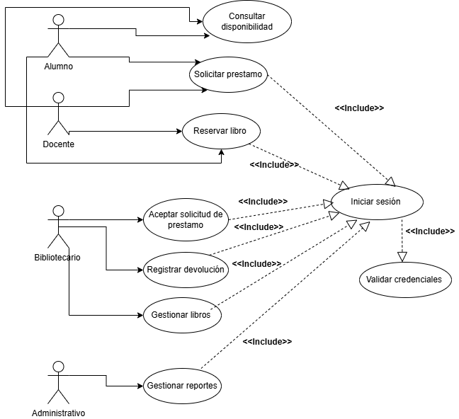
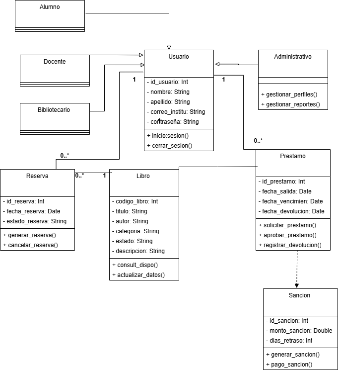
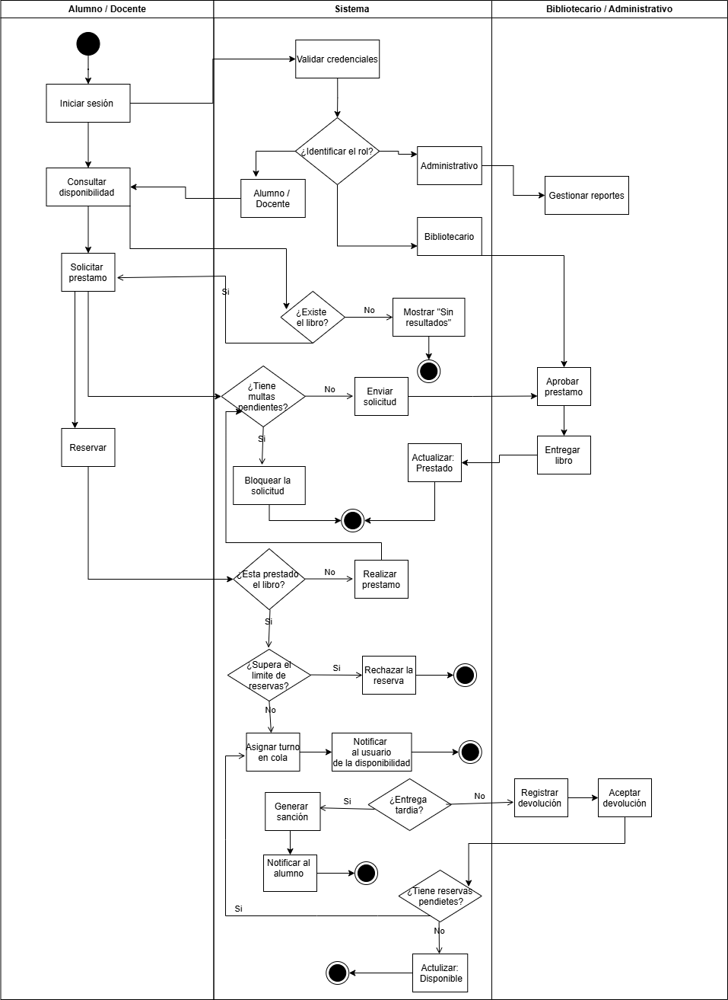

# Diagramas del sistema bibliotecario 📚

## Diagramas de casos de uso 
Este diagrama representa las interacciones entro los actores (alumno, docente, bibliotecario y administrador) y las funcionalidades principales.

## Diagrama de clases
Muestra la estructura estática del sistema, incluyendo clases, atributos, métodos y relaciones.

## Diagrama de actividades
Representa el flujo de las actividades y decisiones dentro de un proceso del sistema. 

